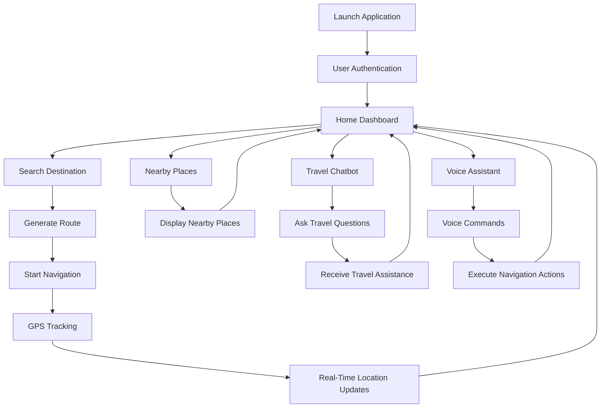
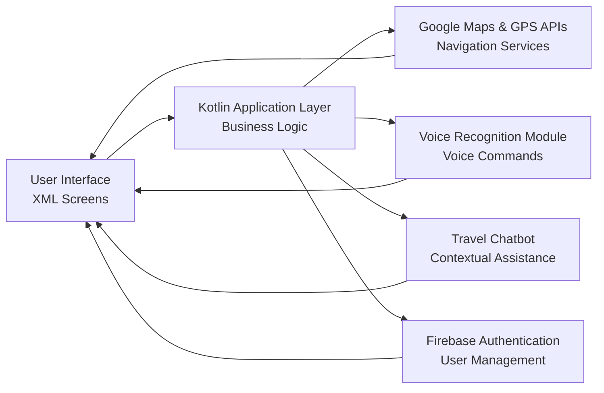
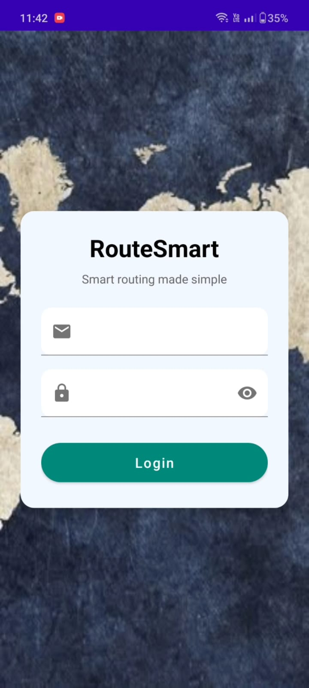
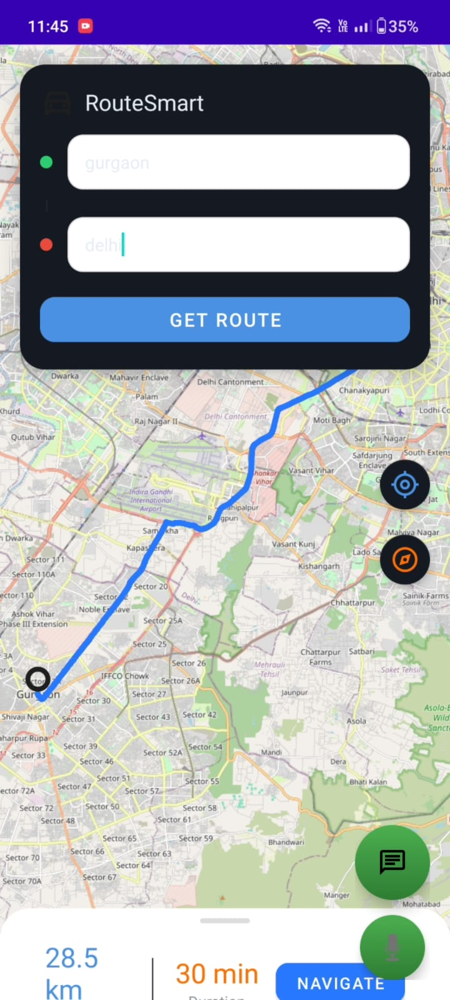
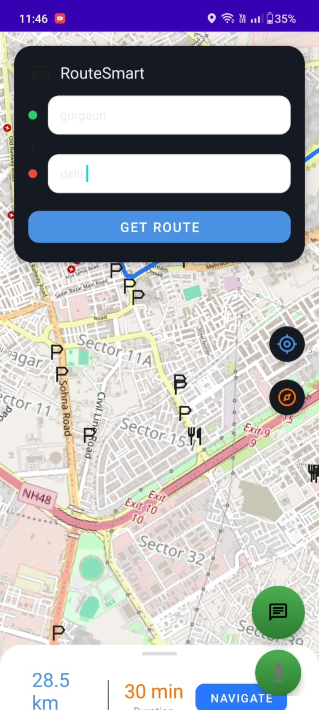
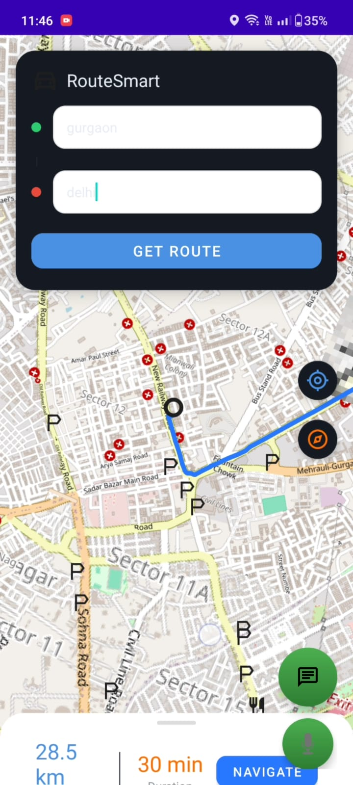
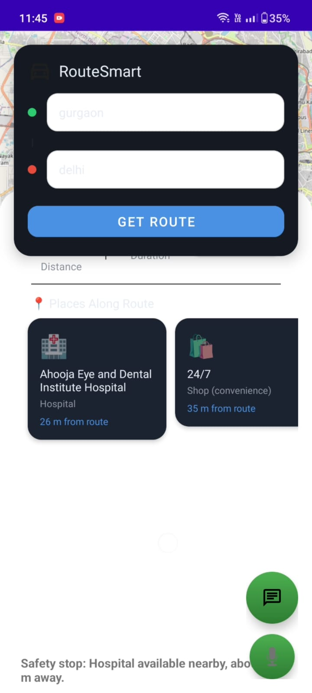
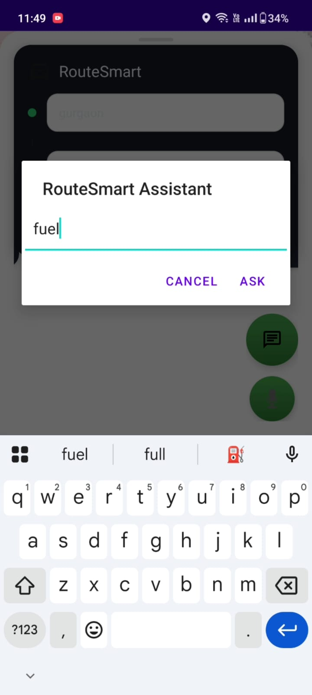
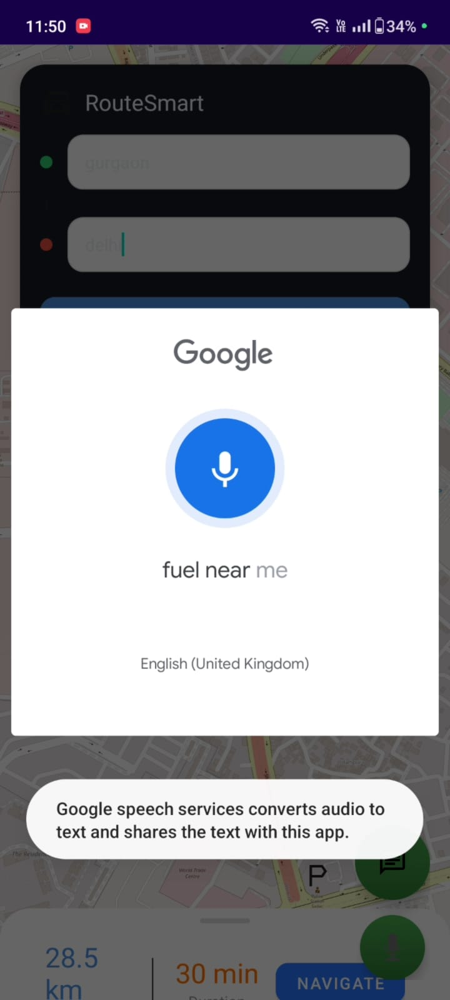

# RouteSmart 🗺️📱

RouteSmart is an intelligent Android navigation assistant developed using Kotlin and XML. Unlike traditional navigation applications that only provide directions, RouteSmart combines navigation with contextual travel intelligence. It offers route generation, nearby place recommendations, GPS tracking, voice interaction, and a travel chatbot to help users during their journeys.

---

## 🚀 Features

* Route generation and navigation assistance
* Real-time GPS location tracking
* Nearby place recommendations
* Voice interaction support
* AI-powered travel chatbot
* Interactive map integration
* User-friendly Android interface
* Modular and scalable architecture

---

## 🏗️ Application Flow

---

## 🛠️ Technologies Used

### Frontend

* XML
* Material Design Components

### Backend

* Kotlin
* Firebase Authentication

### APIs & Services

* Google Maps API
* GPS Location Services
* Voice Recognition APIs

### Development Tools

* Android Studio
* Gradle
* Git & GitHub

---

## 📱 Mobile Application

The Android application allows users to:

* Search and generate travel routes
* Track their live location using GPS
* Discover nearby places and attractions
* Interact using voice commands
* Ask travel-related questions through the chatbot
* Receive contextual travel assistance

---

## ⚙️ Working Principle

1. User logs into the application.
2. The user enters a destination or uses voice commands.
3. The application generates the optimal route.
4. GPS services track the user's current location.
5. Nearby places and travel recommendations are displayed.
6. The chatbot provides travel assistance and answers queries.
7. Voice interaction enables hands-free navigation.

---

## 🧩 System Architecture

---

## 🧪 Testing

The project was tested using:

* Unit Testing
* Integration Testing
* Functional Testing
* User Acceptance Testing

### Results

* Smooth route generation
* Accurate GPS tracking
* Responsive user interface
* Reliable voice interaction
* Stable chatbot assistance

---

## 📌 Applications

* Daily commuting
* Travel assistance
* Tourist navigation
* Route planning
* Hands-free navigation
* Location-based recommendations

---

## 📷 Application Walkthrough

| Login Page                                         | Route Planning                                       | Route Navigation                                         |
| ----------------------------------------------------- | -------------------------------------------------- | ------------------------------------------------------ |
|  |  |  |

| Route with Nearby Places                                         | Nearby Places                                        | AI Travel Assistant                                         |
| ----------------------------------------------------- | -------------------------------------------------- | ------------------------------------------------------ |
|  |  |  |

| Voice Assistant                                         |
| ----------------------------------------------------- |
|  |

---

## 🎥 Project Demonstration

Watch the complete application workflow below:

| 📱 RouteSmart Application Demo |
| ------------------------------ |

https://github.com/user-attachments/assets/fee329ce-2eee-4a6d-bced-2914c9efd902

---

## 🔮 Future Scope

* AI-based route optimization
* Traffic prediction using machine learning
* Weather-aware navigation
* Offline map support
* Emergency assistance features
* Personalized travel recommendations
* Multi-language voice support
* Cloud synchronization across devices

---

## ⭐ Support

If you found this project useful, please consider giving it a **⭐ Star** on GitHub.
